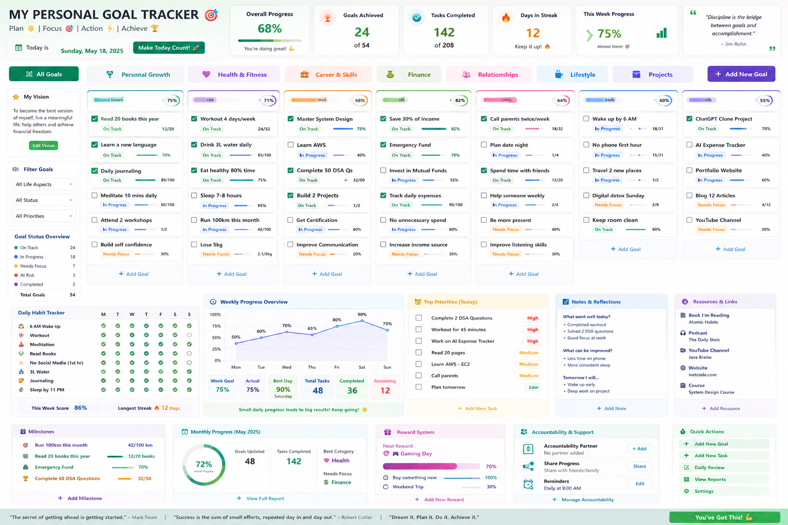

# 🎯 Personal Goal Tracker Dashboard

A premium, responsive, single-page client-side dashboard designed to organize your vision, track long-term goals, log daily habits, manage priorities, and earn rewards. Designed with modern glassmorphism, fluid micro-animations, and full theme support (Light & Dark modes), it runs directly in any browser and can be hosted for free on GitHub Pages.



---

## ✨ Features

- **📱 Single-Page & Fully Responsive**: Cross-device optimization. On desktop, view it as a horizontal kanban-style board. On mobile/tablet, it collapses into a column list or tabs for easy navigation.
- **🛠️ Zero Setup Local Storage**: Automatically saves all changes to your browser's local storage. Start planning immediately with no database required.
- **☁️ Supabase Cloud Sync**: Synchronize your dashboard across all devices by connecting a free Supabase database.
- **🔒 AES-GCM 256-bit Local Encryption**: Option to encrypt your database payload with a password. Your personal data is encrypted *locally in your browser* before uploading, keeping it 100% private.
- **📊 Interactive Charts & Analytics**: Built-in line chart tracking your weekly habit completion percentages and gauges measuring monthly milestones.
- **🎉 Celebrate Wins**: Dynamic confetti bursts celebrate when tasks are completed or when goals are fully achieved.

---

## 🚀 How to Use (Step-by-Step Guide)

### Step 1: Open the Application
1. Download or clone `index.html` and `MockUpOfHtmlPage.png` to a folder on your computer.
2. Double-click `index.html` to open it in your preferred web browser (Chrome, Safari, Edge, Firefox).

### Step 2: Load Demo Data
To see the tracker in its fully populated state (matching the preview mockup):
1. Scroll down to the **Quick Actions** widget at the bottom right.
2. Click **Load Demo Data**.
3. Confirm the pop-up. The dashboard will instantly fill with the default goals, habits, priorities, and notes.

---

## 🛠️ Deep Dive: Managing Your Dashboard

### 1. Goals & Aspect Columns (CRUD)
- **Aspects**: Goals are categorized into 7 aspects (Personal Growth, Health & Fitness, Career & Skills, Finance, Relationships, Lifestyle, Projects).
- **Log Daily Progress**: Instead of checking off a goal immediately, checking a card's checkbox increments progress progressively:
  - **Numeric Goals**: Increments by `+1` (e.g. `12/20` books read becomes `13/20`).
  - **Percentage Goals**: Increments by `+5%` (e.g. `70%` becomes `75%`).
  - **Weight/Custom Goals**: Increments by `+0.1` (e.g. `2.1/5 kg` becomes `2.2/5 kg`).
- **Achieving Goals**: When the progress value reaches the target, the card's status automatically transitions to **Completed**, and confetti is triggered.
- **Edit/Delete**: Click on any goal card to open the Edit Modal, where you can modify the title, category, status, type, current progress, or target. Hover over a card and click the Trash icon to remove it.

### 2. Daily Habit Tracker
- Grid headers represent days of the week (**M, T, W, T, F, S, S**).
- Click on any circle to toggle completion. Green circles indicate habits completed on that day.
- Toggling recalculates your **Weekly Habit Score** (visible at the bottom and in the Weekly Progress chart).
- Longest streak values track consecutive habit achievement.

### 3. Top Priorities & Daily Reviews
- Check off priorities as they are completed.
- Write down your reflections at the end of the day in **Notes & Reflections** (What went well, improvements, tomorrow's plan). These textareas autosave dynamically when you type.

---

## ☁️ Setting Up Cloud Sync (Supabase)

To access your personal goal tracker from any device, follow these steps to connect a free Supabase instance:

### 1. Create a Supabase Project
1. Go to [Supabase](https://supabase.com) and sign up for a free account.
2. Click **New Project** and name it (e.g. `personal-goal-tracker`). Wait for the database setup to complete.

### 2. Set Up the Table
1. In your Supabase Dashboard, click on **SQL Editor** in the left menu.
2. Click **New Query** and copy/paste the following SQL code:

```sql
create table dashboard_data (
  id text primary key,
  data jsonb not null,
  updated_at timestamp with time zone default timezone('utc'::text, now()) not null
);

-- Enable Row Level Security (RLS)
alter table dashboard_data enable row level security;

-- Create policy to allow public access (since keys are client-side or encrypted)
create policy "Allow public access" on dashboard_data for all using (true) with check (true);
```

3. Click **Run** to execute the script and create your table.

### 3. Connect the Dashboard
1. On your Supabase dashboard, click on **Project Settings** (the Gear icon) > **API**.
2. Copy your **Project URL** and your **anon public API Key**.
3. In the Goal Tracker dashboard, click **Sync Settings** under the **Quick Actions** widget.
4. Paste the URL and API Key.
5. Enter a **Dashboard ID** (this is your username or unique database key, e.g. `sanke123`).
6. **(Highly Recommended) Enter a Privacy Password**: If entered, your entire dashboard data is encrypted using 256-bit AES-GCM before being sent to the database. Only you can access your goals!
7. Click **Connect & Sync**. 

Your dashboard is now fully synced! The indicator at the top right will display a green light and show `Synced: [Your Dashboard ID]`. Any future edits will trigger a background sync. If you open `index.html` on a mobile device and input the same credentials, your dashboard will load instantly.
